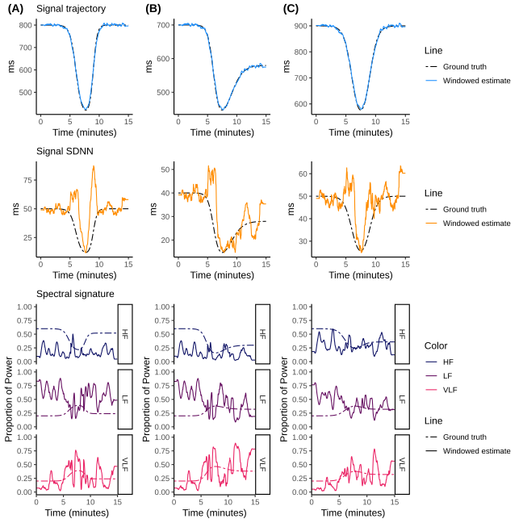
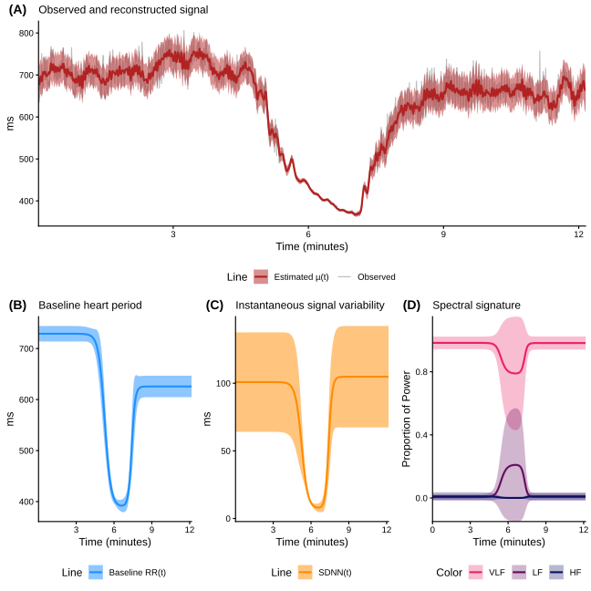
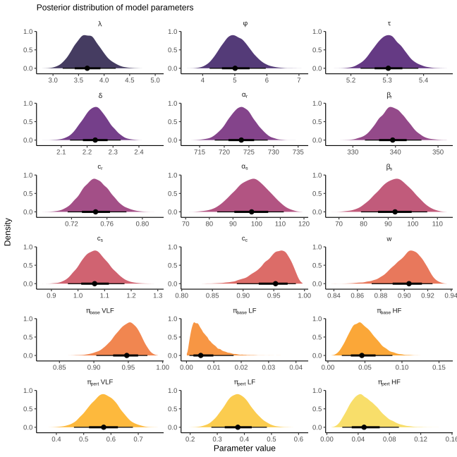

**Abstract**

Heart rate variability (HRV) is the basis of non-invasive autonomic nervous system assessment, yet its analysis is constrained by the non-stationary nature of physiological signals. Standard analytical methods, which assume stationarity within fixed time windows, fail to capture dynamical effects of interest, such as the response to a physiological stressor. This limitation obstructs the development of mechanistic hypotheses about autonomic control. Here, we address this challenge by introducing a unified probabilistic framework for non-stationary HRV analysis. We propose a hypothesis-driven, generative model that transforms the physiological response as a continuous-time stochastic process controlled by a double-logistic function. This approach deconstructs the R-R interval (RRi) series into a set of interpretable parameters representing the latency, rate, and magnitude of distinct response and recovery phases. Through simulation, we establish the model's ability to achieve high-fidelity parameter recovery and show its descriptive superiority over conventional fixed-time window methods. We then apply the framework to an empirical exercise-recovery recording, generating a precise, falsifiable hypothesis of "dissonant autonomic recovery", where mean heart rate and its variability exhibit distinct recovery timescales. This framework provides a formal methodology for translating RRi time series into quantitative, testable estimates of their generative processes.

# Introduction

The central goal in contemporary biomedical science is to mechanistically link the dynamics of physiological systems to human health and disease. A primary obstacle to this goal is the inferential gap between what can be measure with high-temporal resolution via wearable sensors, and the unobservable neurobiological processes that generate these measurements [@huber2025brain]. This "inverse problem" is specially more evident in the study of the autonomic nervous system (ANS), where heart rate variability (HRV) is the dominant non-invasive proxy [@shaffer2017overview]. The R-R interval (RRi) time-series is an invaluable signal, yet it poses a deep analytical challenge: it is a complex, integrated output reflecting the ceaseless, dynamic interplay of multiple regulatory systems [@arakaki2023connection]. Therefore, progress is contingent upon solving this problem of principled inverse inference: the development of a formal methodology to deconstruct this composite signal into quantitative, interpretable, and falsifiable estimates of its underlying generative processes. The urgency of this problem is made more evident by its direct relevance to major public health burdens, as autonomic dysregulation is a core feature of disorders ranging from cardiovascular diseases [@orini2023long; @serhiyenko2024post], to anxiety and post-traumatic stress [@schneider2020autonomic; @cheng2022heart; @tomasi2024heart], where a precise characterization of system dynamics is essential for diagnosis and treatment [@orini2023long].

The analytical tools currently employed by the majority of researchers are unsuited for this task. The prevailing paradigm, which relies on calculating summary statistics within fixed temporal windows, imposes a static, linear worldview on a system that is intrinsically dynamic and non-linear. The use of fixed temporal windows is made on the assumption of stationarity that is inherently violated during any physiological transition of scientific or clinical interest [@shaffer2020critical; @kim2021ultra]. A core limitation for mechanistic inference is relying on static assumptions, producing misleading and often uninterpretable results [@kim2021ultra]. For instance, by averaging across a period of stress recovery, such methods conflate the initial sympathetic response with the subsequent parasympathetic rebound, yielding a single, opaque number that masks the system's adaptive capacity [@shaffer2020critical; @kim2021ultra]. The unavoidable distortion of RRi signals under non-stationary conditions, where their inherent assumptions are not met, can make it impossible to distinguish between a resilient individual who exhibits a rapid and robust recovery from a vulnerable one, with a dampened recovery, a critical biomarker of pathology [@lu2023uncertainties]. This "discretize-and-summarize" approach systematically discards the temporal structure of the data, thereby precluding the direct estimation of core mechanistic properties such as response latencies, rates of change, and adaptive magnitudes, which constitute the very essence of the physiological process [@tiwari2021analysis].

Nonetheless, more sophisticated signal processing and modeling techniques have been proposed, yet these too often fail to resolve the core inferential challenge. They present a false choice between phenomenological description and non-interpretable abstraction. On one hand, time-frequency decompositions, such as the wavelet transform, excel at providing detailed visualizations of spectral dynamics, making them useful for exploratory analysis [@german2014wavelet]. However, they are fundamentally descriptive; they do not instantiate a formal, generative model of the underlying biology. They can show that a change occurred, but they cannot provide a parameterized, testable estimate of what changed [@guo2022review].

On the other hand, more advanced modeling traditions like state-space models (SSMs) offer mathematical intricacy for tracking and forecasting a system's evolution [@martin2018improving; @rosas2024bayesian]. While powerful, their typical formulations trade physiological fidelity for mathematical convenience; the latent states they infer are often defined by statistical properties rather than direct biological identity [@rosas2024bayesian; @liu2024efficient]. Even in more tailored applications designed to enhance interpretability, SSMs excel at tracking continuously varying processes but are not explicitly structured to parameterize the distinct phases of a discrete physiological event, such as the specific onset rate, recovery latency, and adaptive magnitude of a stress response. Consequently, the field remains methodologically stalled, caught between descriptive tools that cannot test mechanisms and abstract models whose parameters do not directly map onto the discrete, event-driven components of a physiological hypothesis.

Bridging the gap between data and mechanism requires an evolution in analytical philosophy, a shift from model-agnostic data description to the construction of hypothesis-driven, generative models. Such an approach should move beyond simply characterizing what the data looks like and instead focus on creating explicit, testable, and quantitative models of the biological processes that produced it. Here, we introduce and validate such a framework, which reframes physiological analysis as a form of formal hypothesis testing. We propose that a stereotyped autonomic response to an acute perturbation is a structured and dynamic process. Consequently, we propose that it can be effectively modeled as a continuous-time stochastic process, allowing us to separate the structured response from inherent biological variability. Specifically, we model the response trajectory using a double-logistic function. This mathematical form is chosen as a parsimonious hypothesis for biphasic dynamics, designed to capture the characteristic onset and subsequent recovery phases [@castillo2025enhancing]. The power of this approach lies in its ability to translate the raw signal into a small set of interpretable mechanistic parameters: the latency, rate, and magnitude of each distinct response phase [@castillo2025enhancing]. This provides a direct, quantitative understanding of the system's underlying reactivity and resilience.

We implement this approach as a novel generative model within a Bayesian framework. This provides robust parameter estimation with full uncertainty quantification, enables hierarchical modeling of individual and group-level effects, and offers a basis for model comparison and evaluation. This model provides a specific and testable implementation of our framework, decomposing the RRi series into a time-varying mean, total variance, and a dynamically shifting oscillatory component, all controlled by a double-logistic latent dynamic. This paper tests the hypothesis that this model provides a more accurate and useful characterization of autonomic dynamics than existing fixed-time window methods. Through simulation, we demonstrate its capacity to recover known ground-truth parameters, which establishes its core validity. We contend that this approach provides the necessary quantitative indices for developing and testing mechanistic physiological hypotheses. This represents a step towards translating complex time-series into falsifiable knowledge.

```{r}
#| include: false
library(data.table)
library(gt)
```

# Results

We first test the model's internal consistency by assessing its ability to recover its own parameters from simulated data. We then benchmark its descriptive fidelity against conventional methods to quantify its effectiveness in characterizing dynamic signals. Finally, we use the framework to generate a structured, phenomenological description of an empirical exercise-response signal, illustrating its potential for developing precise and data-driven hypotheses.

## Model validation and parameter recovery on synthetic data

To establish the model's internal consistency and the identifiability of its parameters, we first assessed its ability to perform inference on synthetic data generated from its own structure. This in-silico procedure serves as a necessary check of the model's self-consistency and the estimation algorithm's ability to navigate the complex posterior geometry. To test the model's performance, designed three distinct scenarios: (A) a canonical response with complete recovery; (B) an incomplete recovery with persistence in both time and frequency domains; and (C) a high-noise condition with a low structured variance fraction ($w$ = 0.6). The ground-truth dynamics are illustrated in Figure 1, with corresponding generative parameter values listed in Table 1. This procedure tests for inferential integrity under the assumption that the model is correctly specified; it does not test for robustness to model misspecification, a challenge inherent to all empirical data.

{width=100%}
**Figure 1. Ground-truth dynamics of three synthetic scenarios.** The scenarios were designed to test model performance under diverse conditions: (A) a classic sympatho-vagal response, (B) an incomplete recovery with persistence in both time and frequency domains, and (C) a high-noise condition with dissonant (complete time-domain, incomplete spectral) recovery. Panels show the generated RRi data with the true mean signal, the underlying time-domain trajectories for baseline RRi and total SDNN, and the time-varying spectral proportions.

```{r}
readRDS(file = "tables/tbl-1.RDS")
```

**Table 1. Ground-truth parameter values for simulation scenarios.** Ground-truth parameter values used in the generation of three simulation scenarios. The scenarios correspond to (A) a classic sympatho-vagal response, (B) an incomplete recovery with time-domain and spectral persistence, and (C) an incomplete spectral but complete time-domain recovery with high noise.

When fit to this synthetic data, the model demonstrated a high-fidelity reconstruction of the generative process across all three scenarios. Figure 2 presents a visual summary of these results, plotting the model's posterior estimates against the known ground-truth trajectories. The posterior means for the baseline RRi, total SDNN, and the time-varying spectral proportions closely track the true underlying dynamics. The 95% credible intervals, which represent the range of plausible parameter values given the data, consistently envelop the ground-truth trajectories.

{width=100%}

**Figure 2. High-fidelity reconstruction of synthetic data by the generative model.** The model's posterior mean estimates (solid lines) and 95% credible intervals (shaded ribbons) are overlaid on the known ground-truth dynamics (dashed lines) for all three scenarios (A, B, C). The model accurately recovers the continuous trajectories for baseline RRi, total SDNN, and spectral proportions across all conditions.

Beyond recovering the continuous dynamic trajectories, the model also recovered the discrete parameters that govern the shape and timing of these dynamics. Table 2 presents the posterior summaries for these key parameters, comparing the posterior median and 95% credible intervals against their true values. For all parameters across all scenarios, the 95% credible intervals successfully contained the ground-truth values. Successfully recovering all parameters confirms that they are practically identifiable from this type of data, at least when the data-generating process aligns with the model's structural assumptions.

```{r}
#| column: screen-inset-left
readRDS(file = "tables/tbl-2.RDS")
```

**Table 2. Posterior recovery of ground-truth parameters.** This table compares the known ground-truth parameter values to the model's posterior estimates (median and 95% credible interval). The model successfully recovers all parameters, with the true values consistently falling within the credible intervals.

### Benchmarking the model's descriptive fidelity

Having established the model's internal consistency, we next benchmarked its descriptive performance against conventional, widely adopted analytical methods. The objective of this comparison was to quantify the core differences in how these analytical frameworks represent and summarize dynamic signals, and to highlight the specific conditions under which our proposed model offers a more advantageous description. The same synthetic datasets from the previous section were analyzed using a 60-second sliding-window analysis for time-domain metrics (mean RRi and SDNN), and a Short-Time Fourier Transform (STFT) with a similar window length for characterizing spectral dynamics.

The results of this comparative analysis highlights the descriptive distortions that are inherent to any method that relies on assumptions of local stationarity when applied to a continuously varying, non-stationary signal. Figure 3 illustrates the outputs from the windowed methods. Visually, these methods produced a delayed and morphologically blunted approximation of the underlying dynamics. The sharp, non-linear transitions that characterize the onset and recovery phases of the signal are smeared and flattened by the averaging process inherent in the windowed calculation. Consequently, the windowed approach failed to accurately capture both the shape and the precise timing of the recovery process. Instead of reflecting the smooth, logistic curve defined by the ground-truth process, the windowed analysis superimposed the square-wave artifacts of its own computational structure onto the data, a clear instance of the analytical method distorting the phenomenon it is intended to measure.

{width=100%}

**Figure 3. Distorted reconstruction of synthetic data by conventional windowed Methods.** The estimates from a 60-second sliding window (for RRi and SDNN) and an STFT (for spectral proportions) are shown as solid lines overlaid on the ground-truth dynamics (dashed lines). The methods introduce significant lag, blunting, and temporal smearing, failing to capture the true non-linear dynamics.

A formal quantitative analysis confirms the descriptive efficiency and accuracy of the generative approach for signals of this particular nature. Table 3 provides a summary of key performance metrics. Across all scenarios and all signal components, the generative model consistently provided a more accurate and parsimonious description of the data. It achieved substantially lower error (RMSE and Bias) and captured a significantly higher proportion of the signal's variance, with $R^2$ values typically exceeding 0.90. It is important to interpret this result with caution. The model's performance is, in one sense, expected, as the synthetic data were generated from its own structure. However, it illustrates a core theoretical argument of this work: for signals that are plausibly characterized by smooth, continuous transitions between distinct physiological states, a model whose parametric form explicitly encodes this structure will naturally provide a more efficient, less distorted, and more interpretable quantitative summary than a non-parametric, windowed approach that was designed for stationary or quasi-stationary signals.

```{r}
#| column: screen-inset-left
readRDS(file = "tables/tbl-3.RDS")
```

**Table 3. Quantitative Performance Metrics for the Generative Model versus Windowed Methods.** This table presents the root mean squared error (RMSE) and mean absolute error (MAE) as measures of the average magnitude of the estimation error; Bias (mean error) identify any systematic tendency for over- or underestimation; and the coefficient of determination ($R^2$) to assess the proportion of variance in the true signal captured by the estimate.

## A phenomenological description of an empirical exercise response

To illustrate the framework's intended application in a real-world context, we analyzed an RRi time series recorded from a single healthy subject undergoing a standardized two-minute submaximal step test. The express purpose of this N-of-1 analysis is to demonstrate how the model translates a complex, high-dimensional, and noisy time series into a concise, low-dimensional, and interpretable set of parameters that form the basis for generating new, quantitative, and ultimately falsifiable hypotheses.

Upon fitting the model to the empirical data, it yields a phenomenological decomposition of the entire exercise-recovery response, as depicted in Figure 4. The framework parses the signal into its constituent components, describing the physiological process as a rapid initial tachycardia (a decrease in the baseline RRi component) and a concurrent suppression of total heart rate variability (a decrease in the SDNN component). This initial response is followed by a slower, more gradual recovery phase after the cessation of the exercise stimulus. From a spectral perspective, the model attributes the signature of this response to a near-complete withdrawal of power in the high-frequency (HF) band, a correlate of parasympathetic activity, and a corresponding surge in the proportion of very-low-frequency (VLF) power, a band whose physiological interpretation remains debated but is often associated with sympathetic and other systemic influences. The model captures these dynamics as continuous, smooth trajectories, providing an integrated narrative of the entire physiological event.

{width=100%}

**Figure 4. Phenomenological decomposition of an empirical exercise-recovery response.** (A) The reconstructed $\mu(t_i)$ RRi signal (red line) overlaid on top of the observed RRi signal (gray). (B-C) time-domain components: the baseline RRi trend ($\mathrm{RR_{base}}$, blue) and the total instantaneous variability ($\mathrm{SDNN}$, orange). (D) The inferred dynamics of the spectral proportions. Shaded regions are 95% highest density intervals.

The framework's primary scientific utility, however, lies in generating quantitative, testable claims, which are encapsulated by the posterior distributions of its parameters (Figure 5). A key feature of the model is its separate parameterization of the recovery dynamics of the signal's first moment (mean RRi, via the coefficient $c_r$) and its second moment (total variability, or SDNN, via the coefficient $c_s$). This explicit separation allows for a direct, quantitative description of their potential divergence. In this particular recording, the posterior distributions for these two recovery parameters were credibly distinct; the 95% credible interval for $c_r$ was clearly separated from that for $c_s$. This descriptive feature of the model's output, which we term model-inferred dissonance, provides a data-driven and falsifiable hypothesis: that the recovery of mean heart rate and the recovery of its variability can follow distinct and dissociable time courses in response to an acute exercise stressor. This hypothesis is a quantitative statement, grounded in the posterior probability distributions of the model's parameters.

{width=100%}

**Figure 5. Posterior distribution of phenomenological recovery parameters from the empirical analysis.** The posterior distribution for the recovered coefficients of transient changes in mean RRi, total SDNN, and spectral balance, alongside the structured variance fraction ($w$). The posterior distribution allows for visual inspection of model convergence of model parameters.

# Discussion

The quantitative analysis of HRV has long been a principal method for the non-invasive study of the autonomic nervous system [@malik1990heart; @shaffer2017overview]. A persistent challenge in this field is the inherent non-stationarity of physiological signals, which directly conflicts with the foundational assumptions of traditional analytical techniques [@voss2009methods; @shaffer2020critical; @kim2021ultra], which were often adopted due to the computational constraints of their era. This discrepancy necessitates the use of methodological compromises, most notably time-windowing, which can introduce significant analytical artifacts and obscure the very dynamics they seek to quantify [@rajendra2006heart; @lu2023uncertainties]. The present study was undertaken to develop and evaluate a generative probabilistic model for RRi time series, explicitly designed to represent and infer the parameters of transient physiological events. Our findings, based on a comprehensive suite of simulations and an empirical application, suggest that this inferential paradigm provides a more accurate and granular characterization of autonomic dynamics than is achievable with conventional windowed approaches. Our generative model offers a more detailed characterization of autonomic dynamics, however its interpretation requires careful consideration of its underlying assumptions.

The primary contribution of this research is the novel synthesis and application of established Bayesian inference principles to construct a purpose-built, physiologically-oriented measurement instrument [@ghahramani2013bayesian]. The model formalizes a specific, falsifiable hypothesis about the data-generating process underlying dynamic RRi signals. We employ the term *generative* to signify this complete probabilistic specification, which enables a coherent inferential procedure regarding the model's latent parameters. The internal validity and statistical integrity of this inferential process were examined through extensive simulation studies. In these controlled in-silico experiments, where the ground truth was known, the model consistently recovered the generative parameters, and its posterior credible intervals were well-calibrated [@cook2006validation; @talts2018validating]. The model's successful parameter recovery in these controlled simulations provides baseline confidence in its function as a reliable measurement device, but only under conditions where its numerous and restrictive structural assumptions are perfectly met. When benchmarked against conventional methods, its superior performance in tracking dynamic signals was observed. This outperformance is an expected consequence of its design, which replaces the crude filtering of windowing with a formal, continuous model of the underlying process. However, the apparent sophistication of this approach belies a series of deep-seated assumptions and conceptual challenges that demand scrupulous consideration.

## Methodological superiority and the abandonment of stationarity

A core assertion of this work is that the analytical shortcomings of traditional HRV analysis are conceptual, not merely technical. Windowed methods are, in essence, digital filters [@sassi2015advances]. As such, they inevitably distort the signal they are intended to measure, introducing lag, attenuating amplitudes, and enforcing a false dichotomy between temporal and spectral resolution as dictated by the Heisenberg-Gabor uncertainty principle [@deka2023detection]. The inferential approach adopted here avoids these specific artifacts by modeling the entire time-course of an event holistically. Information from every data point is leveraged to inform the estimate at every other data point, conditioned on the assumed model structure [@shashikant2021gaussian].

However, this approach introduces its own set of abstractions. A potentially problematic assumption is the model's imposition of orthogonality on a non-orthogonal system. The model specifies the observed RRi signal as a linear, additive combination of a baseline trend, several sinusoidal components, and a residual noise term. This mathematical decomposition is elegant and ensures parameter identifiability [@hines2014determination; @hyvarinen2024identifiability], nonetheless it is a convenient simplification of cardiovascular physiology.

Similarly, in physiology, the systems underlying these model components are deeply and non-linearly coupled. Baroreflex activity (a major contributor to the low-frequency component) and respiratory sinus arrhythmia (the high-frequency component) are not independent processes that simply sum together; they are neurologically intertwined within the brainstem and are engaged in a constant, dynamic feedback loop [@polanczyk1998sympathetic; @gregoire2023autonomic]. By construction, the model is designed to assign variance to its clean, orthogonal components in a way that may not map cleanly onto the underlying biology. The estimate for the amplitude of the high-frequency component, for instance, should be interpreted as the magnitude of the best-fitting sinusoidal component in that band, assuming it can be linearly and additively separated from all other ongoing dynamics, rather than a pure measure of respiratory sinus arrhythmia. The model's simplifying assumption of linear, additive separation is an important caveat for physiological interpretation that requires careful consideration [@lundberg2017unified].

## From statistical constructs to biological reality

The intended value of this framework is its ability to distill a complex signal into a set of "interpretable" parameters. This claimed interpretability, however, occupies a position between useful abstraction and the risk of equating a parameter with a physical process [@ramstead2022generative; @thiele2024choosing]. The very act of assigning a label like "recovery rate" to a parameter ($\phi$) cognitively biases the researcher to perceive it as a distinct, tangible biological process [@navarro2021risk]. While the parameter perfectly describes a feature of the fitted mathematical curve, it is an unsubstantiated inferential leap to equate it with a singular neurophysiological mechanism [@rosenberg2018prediction; @thiele2024choosing]. The observed recovery trajectory is the net result of an immensely complex cascade of interacting neural, endocrine, and humoral processes [@lu2023uncertainties; @gregoire2023autonomic; @colebank2024guidelines]. The model's parameterization of this trajectory is a descriptive summary, rather than an elucidation of its constituent parts.

Such interpretive discipline, separating a mathematical parameter from a singular biological process, must be applied to all model outputs. The concept of "dissonant autonomic recovery", for example, is a statistically identifiable pattern where heart rate returns to baseline far more quickly than measures of heart rate variability [@lee2012dissociation]. Yet, its proposed link to "lingering sympathetic activation" remains a speculative hypothesis requiring external validation. Could this pattern alternatively reflect differential downregulation rates of adrenergic and cholinergic receptors, or a mismatch in the resetting of central autonomic command versus peripheral feedback? These are precisely the kinds of sophisticated hypotheses the model allows one to formulate, but it possesses no inherent capacity to adjudicate between them. It provides the tool to quantify the phenomenon with precision, thereby allowing to test such hypotheses [@sankaran2023generative], but it cannot, on its own, provide definitive causal evidence.

Nowhere is this interpretive caution more warranted than with the structured variance fraction, $w$. Its proposed role as an index of "autonomic coherence" is a compelling narrative, but one that rests on a fragile foundation. At its core, $w$ is simply the proportion of signal variance captured by a fixed set of sinusoids. A reduction in $w$ could plausibly reflect a pathological dysregulation of autonomic rhythms [@solis2020entropy]. However, it could equally reflect a plethora of other confounders: an increase in movement artifact, the presence of uncorrected ectopic beats, a change in breathing frequency outside the canonical high-frequency band, or activation of other physiological processes that contribute to RRi variance but are not sinusoidal [@kim2021ultra; @tiwari2021analysis; @lu2023uncertainties]. To label this and other model parameters with a term as specific is, at best, premature and risks imbuing it with a degree of physiological certainty that it does not currently warrant.

## Limitations

The model's credibility depends on acknowledging its limitations, which are both foundational and practical.

The model's architecture is built upon a series of rigid assumptions. The choice of a symmetric double-logistic function is a matter of mathematical convenience [@castillo2025enhancing], not physiological imperative; asymmetric biological recovery processes are common and would be poorly approximated by this functional form. Moreover, the model is a specialist instrument designed for a single, isolated perturbation-recovery event [@castillo2025enhancing]. This make it highly effective for analyzing clean, stimulus-response experimental paradigms but makes it unsuited for the exploratory analysis of complex, naturalistic data containing multiple, overlapping events of unknown form [@voss2009methods; @kim2021ultra]. It is a tool for confirmatory, not exploratory, science.

Furthermore, we acknowledge that the empirical validation of this framework is presently confined to a single-subject case study. This was a deliberate choice reflecting the manuscript's primary aim: to introduce and validate a new methodological framework, not to make a generalizable empirical claim. The N-of-1 analysis serves as a proof-of-concept, demonstrating the model's ability to perform a deep phenotyping of an individual's response and, most importantly, to generate precise, falsifiable hypotheses. We contend that establishing this hypothesis-generating capacity is a necessary prerequisite to the much larger, and computationally demanding, task of applying the model hierarchically to a full cohort. This foundational work is offered to empower the broader research community to test these newly generated hypotheses on larger, more diverse datasets.

The adoption of a Bayesian framework, while providing intuitive probabilistic outputs, comes with its own methodological assumptions. The posterior credible interval for a parameter is a statement of subjective belief about its value, conditional on the data, the chosen model structure, and the specified prior distributions [@ghahramani2013bayesian]. It is not equivalent to a frequentist confidence interval and does not account for structural uncertainty, the possibility that the model itself is misspecified. This leads to what might be termed the "Rashomon effect" in modeling, where multiple, structurally different models can provide equally good fits to the data while telling different and contradictory stories about the underlying process [@kalinin2022atomically]. Without a systematic exploration of this "model space", the conclusions drawn from this single model must be regarded as highly provisional.

The model's reliance on Hamiltonian Monte Carlo sampling makes it computationally expensive. The required runtime may not only be a practical barrier for large datasets but could also create an "analytical divide", where such advanced methods are only accessible to research groups with substantial computational resources. This effectively sidelines the method from deployment in real-time or near-real-time clinical settings, such as intensive care monitoring, where rapid feedback is paramount. Furthermore, the model's performance is linked to upstream data fidelity. Uncorrected premature ventricular contractions or excessive measurement noise, for instance, could drastically alter the local mean and variance of model parameters. While the model may be robust to small deviations, its behavior in the face of such gross, non-stationary artifacts is unknown and could lead to biased inference on the entire stress-recovery curve. Finally, the treatment of the residual term as unstructured "noise" is a convenient assumption. In biology, true randomness is rare; the residuals likely contain unmodeled, structured biological processes or deterministic chaos.

## Future directions

The limitations catalogued above define a necessary line for future research. This line of research should move beyond incremental model refinement and toward the systematic characterization of the model as a scientific instrument.

The most urgent task is to begin the process of instrument calibration. Just as a new telescope must have its optical aberrations mapped and its resolution quantified, this model requires a comprehensive characterization of its operational properties. An ideal future study would involve establishing a formal calibration protocol: creating a standardized open-source library of synthetic RRi signals with known complexities, asymmetric responses, overlapping events, various artifact types, and non-Gaussian noise, and then systematically testing the model against this library. The results, published as a detailed "specification sheet", would delineate the model's biases, sensitivities, and failure modes, defining its safe operating envelope for future users.

Furthermore, future work must focus on using the model for quantitative hypothesis falsification. The framework should be applied in experimental contexts where specific interventions are known to target certain physiological pathways. For instance, testing the effect of beta-blockade on the response amplitude and recovery rate parameters following a cold pressor or exercise-based test would provide crucial external validation, linking the model's abstract parameters to tangible pharmacological effects. This shifts the focus from "fitting a model" to "using a model to test a theory" [@kalinin2022atomically; @sankaran2023generative].

The generative framework presented here represents a conceptually powerful alternative to conventional methods for analyzing dynamic HRV. Ultimately, this model should be viewed as a specialized instrument, rather than as a perfect reflection of reality. Its value lies in its ability to translate a complex signal into a set of precise, falsifiable hypotheses. The difficult work of calibrating this instrument, understanding its distortions, and cautiously deploying it to test concrete physiological hypotheses will ultimately determine its lasting contribution to the science of autonomic control.

# Methods

## Model formulation

We presented a comprehensive generative model for the RRi signal, observed at a discrete set of time points $\{t_i\}_{i=1}^N$. The model's architecture is designed to deconstruct the signal into its constituent physiological components, providing a mechanistic account of the processes that shape heart rate dynamics. This is achieved by conceptualizing the signal as a probabilistic process controlled by a time-varying mean, $\mu(t_i)$, and a partitioned, time-varying standard deviation. This sophisticated approach moves beyond simple curve-fitting to formalize a theory of autonomic control and its temporal evolution within a fully Bayesian framework. 

A central component of the model is the partitioning of the total signal variance into two distinct, time-dependent components: a structured variance, $\sigma^2_{\text{struct}}(t_i)$, which captures the physiologically meaningful, oscillatory patterns of HRV, and a residual variance, $\sigma^2_{\text{resid}}(t_i)$, which accounts for unstructured, moment-to-moment fluctuations or measurement noise. The complete observation model, which integrates these components, is defined by the Normal likelihood in @eq-full-likelihood.

$$
\mathrm{RRi}(t_i) \sim \mathcal{N}\left(\mu(t_i), \sigma_{\text{resid}}(t_i)\right)
$${#eq-full-likelihood}

The core of the model lies in the construction of the mean and variance components from a shared set of underlying dynamic functions. The mean trajectory, $\mu(t_i)$, is a superposition of a smoothly varying baseline trend and the synthesized structured signal itself, as shown in @eq-mean-model.

$$
\mu(t_i)
= \underbrace{\mathrm{RR_{base}}(t_i)}_{\substack{\text{Gross}\\\text{RRi Trend}}}
+
\underbrace{A(t_i) \cdot \sum_{j=1}^{J} p_j(t_i) \cdot S_j(t_i)}_{\substack{\text{Structured Variability Signal}}}
$${#eq-mean-model}

Here, $\mathrm{RR_{base}}(t_i)$ represents the gross, underlying heart period trajectory. The structured variability signal is synthesized from a set of dynamically evolving spectral oscillators, $S_j(t_i)$, which represent activity in different physiological frequency bands ($j=1,2,3$ for VLF, LF, and HF, respectively). These oscillators are weighted by time-varying proportions, $p_j(t_i)$, and their overall magnitude is controlled by a scaling amplitude, $A(t_i)$. This amplitude is deterministically calculated to ensure the signal's variance exactly matches the target structured variance, $\sigma^2_{\text{struct}}(t_i)$.

A pivotal feature is a dynamic trajectory for the total signal variability, denoted $\mathrm{SDNN}(t_i)$, which is then partitioned into its structured and residual components. This partition is controlled by a parameter, $w \in [0, 1]$, which represents the fraction of total variance attributable to the structured component, as defined in @eq-var-structure.

$$
\begin{aligned}
\sigma^2_{\text{struct}}(t_i) &= w \cdot \mathrm{SDNN}(t_i)^2 \\
\sigma^2_{\text{resid}}(t_i) &= (1-w) \cdot \mathrm{SDNN}(t_i)^2
\end{aligned}
$${#eq-var-structure}

This formulation allows the model to simultaneously learn not only how the total amount of HRV changes over time (via $\mathrm{SDNN}(t_i)$), but also how the nature of that variability evolves, that is the balance between predictable, oscillatory patterns and unpredictable noise (via $w$). This unified analysis facilitates a deeper understanding of autonomic regulation by capturing phenomena across both time and frequency domains within a single, coherent inferential framework.

### Baseline heart period and total variability trajectories

The model posits that the primary trends in both the mean heart period and its total variability are driven by a common underlying physiological response to a stimulus. To capture this, both the $\mathrm{RR_{base}}(t_i)$ and $\mathrm{SDNN}(t_i)$ trajectories are parameterized using the same flexible double-logistic functional form.

The baseline heart period, $\mathrm{RR_{base}}(t_i)$, which quantifies the gross, underlying variations in the mean RRi, is defined in @eq-rri-baseline-model.

$$
\mathrm{RR_{base}}(t_i) =
\underbrace{\alpha_r}_{\substack{\text{Resting RRi}}}
-
\underbrace{\beta_r \cdot \mathcal{D}_{1}(t_i)}_{\substack{\text{Perturbation-induced}\\\text{RRi Drop}}}
+
\underbrace{c_r \beta_r \cdot \mathcal{D}_{2}(t_i)}_{\substack{\text{Post-perturbation}\\\text{RRi Recovery}}}
$${#eq-rri-baseline-model}

In this formulation, $\alpha_r$ represents the initial, stable heart period. The parameter $\beta_r$ signifies the magnitude of the decline in RRi induced by the perturbation. The fractional recovery amplitude is denoted by $c_r$, where $c_r > 1$ indicates an overshoot.

Concurrently, the total instantaneous variability, $\mathrm{SDNN}(t_i)$, follows a parallel dynamic trajectory, as defined in @eq-sdnn-model.

$$
\mathrm{SDNN}(t_i) =
\underbrace{\alpha_s}_{\substack{\text{Resting SDNN}}}
-
\underbrace{\beta_s \cdot \mathcal{D}_{1}(t_i)}_{\substack{\text{Perturbation-induced}\\\text{SDNN Drop}}}
+
\underbrace{c_s \beta_s \cdot \mathcal{D}_{2}(t_i)}_{\substack{\text{Post-perturbation}\\\text{SDNN Recovery}}}
$${#eq-sdnn-model}

Here, $\alpha_s$, $\beta_s$, and $c_s$ are analogous to their counterparts in the baseline model, representing the resting total SDNN, the magnitude of its suppression, and its fractional recovery, respectively. The dynamics for both trajectories are driven by a shared pair of logistic transition functions, $\mathcal{D}_{1}(t_i)$ and $\mathcal{D}_{2}(t_i)$, defined in @eq-logistic-components.

$$
\begin{aligned}
\mathcal{D}_{1}(t_i) &= \left(1+ e^{-\lambda (t_i - \tau)}\right)^{-1} \\
\mathcal{D}_{2}(t_i) &= \left(1+ e^{-\phi (t_i - \tau - \delta)}\right)^{-1}
\end{aligned}
$${#eq-logistic-components}

The shared timing parameters enforce physiological coupling: $\tau$ is the inflection point of the initial response, with rate $\lambda$. The second transition, representing recovery, is offset by a delay $\delta$ and proceeds at a rate $\phi$. This shared structure ensures that changes in the magnitude of variability are temporally synchronized with changes in the mean heart period, while still allowing their relative magnitudes and recovery profiles to differ.

### Generative model for the structured signal

The structured component of the signal is where the model's spectral properties are defined. Its construction involves three key elements: the dynamic spectral proportions, the latent spectral oscillators (whose amplitudes are governed by a Gaussian Process), and a deterministic amplitude inversion that ties them to the target variance.

#### Dynamic frequency band proportions

The proportions $p_j(t_i)$ dictate how the total structured variance, $\sigma^2_{\text{struct}}(t_i)$, is allocated across the different frequency bands at each moment. The model captures the evolution of these proportions as a smooth transition between two distinct spectral states: a baseline state ($\vec\pi_{\text{base}}$) and a perturbed state ($\vec\pi_{\text{pert}}$). The transition is determined by a single master controller function, $C(t_i)$, as shown in the convex combination of @eq-pj-using-ct.

$$
\vec{p}(t_i) = (1 - C(t_i)) \cdot \vec\pi_{\text{base}} + C(t_i) \cdot \vec\pi_{\text{pert}}
$${#eq-pj-using-ct}

Here, $\vec\pi_{\text{base}}$ and $\vec\pi_{\text{pert}}$ are simplex vectors representing the characteristic spectral distributions at rest and during peak perturbation. The master controller, $C(t_i)$, is itself built from the same logistic building blocks, ensuring the spectral transition is synchronized with the primary physiological response, as defined in @eq-master-controller.

$$
C(t_i) = \mathcal{D}_{1}(t_i) \cdot \left(1 - c_c \cdot \mathcal{D}_{2}(t_i)\right)
$${#eq-master-controller}

This function naturally transitions from 0 towards 1, with the parameter $c_c \in [0, 1]$ allowing for an incomplete spectral recovery.

#### Latent spectral oscillators via a Gaussian Process prior

A central task of the model is to infer the power of oscillations across a range of frequencies from the observed data. A simple approach might impose a rigid mathematical structure on the spectrum (e.g., a $1/f^b$ power law) or treat the power at each frequency as independent. However, physiological spectra are rarely so simple; they typically exhibit smooth, continuous shapes with broad peaks.

To capture this realistic structure, we employ a flexible, non-parametric Gaussian Process (GP) prior. A GP is a statistical tool that allows us to place a prior on an unknown function, enforcing the assumption that it is smooth [@binois2022survey]. In this context, it formalizes the intuition that the amplitudes of nearby frequencies should be similar, allowing the model to learn the characteristic shape of the spectrum within each band directly from the data.

Each underlying oscillator, $S_j(t_i)$, which contributes to the structured variability, is modeled as a sum of simple sine and cosine waves with pre-specified frequencies ($f_{j,k}$) but unknown amplitudes ($u_{j,k}$), as shown in @eq-multi-sine-fun.

$$
S_j(t_i) = \sum_{k=1}^{K_j} \left[ u_{j,k}^{(\sin)} \sin(2 \pi f_{j,k} t_i) + u_{j,k}^{(\cos)} \cos(2 \pi f_{j,k} t_i) \right]
$${#eq-multi-sine-fun}

The key innovation is the GP prior placed on the log-amplitude envelope, a vector denoted $\vec{v}_j$. To make the prior on the GP's smoothness parameter stable and interpretable, the GP is defined over a log-frequency axis that has been scaled to the unit interval for each band. Let this scaled log-frequency be denoted $\tilde{f}_{j,k}$. The log-amplitude envelope is modeled as a single draw from a GP with a zero-mean function and a squared exponential covariance kernel ($\mathbf{K}_j$), defined in @eq-gp-kernel.

$$
\vec{v}_j \sim \mathcal{GP}(\vec{0}, \mathbf{K}_j), \quad \text{where } \mathbf{K}_j = \exp\left(-\frac{(\tilde{f}_{j} - \tilde{f}_{j}^\prime)^2}{2\,\rho_{gp,j}^2}\right)
$${#eq-gp-kernel}

The covariance matrix $\mathbf{K}_j$ is controlled by a single hyperparameter, the length-scale $\rho_{gp,j}$. The marginal standard deviation of the GP is fixed to 1. This is because the GP's role is strictly to define the *shape* of the spectrum, not its absolute magnitude; the magnitude is handled by downstream normalization and scaling. The length-scale $\rho_{gp,j}$ is constrained to the [0, 1] interval and controls the smoothness of the function on the unit-scaled input axis. A value near 1 enforces a very smooth, slowly changing shape, while a value near 0 allows for more rapid variations and narrower spectral peaks.

To ensure this model can be estimated efficiently, we use a non-centered parameterization. This is a computational technique that improves the performance of the sampler by reducing correlations between parameters [@betancourt2015hamiltonian]. Instead of estimating the highly correlated vector $\vec{v}_j$ directly, the model estimates a vector of independent standard normal deviates, $\vec{z}_{gp,j}$. The target log-amplitude envelope is then deterministically constructed via the transformation $\vec{v}_j = \mathbf{L}_j \vec{z}_{gp,j}$, where $\mathbf{L}_j$ is the Cholesky factor of the covariance matrix ($\mathbf{K}_j = \mathbf{L}_j \mathbf{L}_j^\top$). This approach makes the estimation problem much simpler for the algorithm, leading to more robust and reliable inference.

#### Normalization for identifiability

A critical step in the model's construction is to ensure that its parameters are identifiable, meaning there is a unique set of parameters that explains the data. A potential ambiguity arises because two components of the model control amplitude: the GP's marginal standard deviation ($\alpha_{gp,j}$) and the overall signal amplitude, $A(t_i)$. Without a constraint, the model could achieve the same result by increasing the GP's amplitude while decreasing $A(t_i)$, making it difficult to interpret either parameter.

To resolve this, we enforce a clear division of labor. The Gaussian Process is assigned the exclusive role of determining the relative shape of the spectrum, while $A(t_i)$ is assigned the role of setting the absolute power.

This is achieved by normalizing the amplitude envelope derived from the GP. First, let $\vec{a}_j = \exp(\vec{v}_j)$ be the vector of positive amplitudes determined by the GP. We then create a normalized scaling vector, $\vec{s}_j$, such that the expected variance of the synthesized oscillator $S_j(t_i)$ is precisely 1.

Because the final coefficients $u_{j,k}$ are generated by scaling standard normal deviates ($z_{j,k} \sim \mathcal{N}(0,1)$), the appropriate normalization must be based on the expected variance of this random process. A key property of this process is that the expected value of cross-products between independent random coefficients is zero. Consequently, the total expected variance simplifies to a sum that depends only on the diagonal elements of the pre-computed Gram matrices ($\mathbf{G}_{\sin,j}$ and $\mathbf{G}_{\cos,j}$). This procedure is formalized in @eq-normalization.

$$
\vec{s}_j = \frac{\vec{a}_j}{\sqrt{\sum_{k=1}^{K_j} a_{j,k}^2 \left( (\mathbf{G}_{\sin,j})_{kk} + (\mathbf{G}_{\cos,j})_{kk} \right)}}
$${#eq-normalization}

The final oscillator coefficients are then constructed as $u_{j,k}^{(\sin)} = z_{j,k}^{(\sin)} \cdot s_{j,k}$ and $u_{j,k}^{(\cos)} = z_{j,k}^{(\cos)} \cdot s_{j,k}$. This procedure ensures that the GP component only informs the spectral shape, normalized to have a unit expected variance, thereby removing the ambiguity and making the model's parameters clearly interpretable.

#### Deterministic Amplitude Inversion

The final step is to ensure that the synthesized structured signal, $X(t_i) = A(t_i) \sum_{j=1}^J p_j(t_i) S_j(t_i)$, has a variance equal to the target structured variance, $\sigma^2_{\text{struct}}(t_i)$, at every time point. A key feature of this model is that it does not assume the sinusoids form an orthogonal basis over the discrete, finite time domain. Instead, it computes the exact sample variance for each synthesized oscillator, $\mathrm{Var}[S_j(t_i)]$, given the current values of its coefficients.

Let $\mathbf{\Sigma}_S$ be the diagonal $3 \times 3$ matrix whose entries are these computed variances, $\mathbf{\Sigma}_S[j, j] = \mathrm{Var}[S_j(t_i)]$. Assuming independence between the bands, the variance of the weighted sum is given by the quadratic form in @eq-weighted-sum.

$$
\mathrm{Var}\left[\sum_{j=1}^J p_j(t_i) S_j(t_i)\right] = \vec{p}(t_i)^\top \mathbf{\Sigma}_S \; \vec{p}(t_i)
$${#eq-weighted-sum}

The variance of the complete structured signal is $\mathrm{Var}[X(t_i)] = A(t_i)^2 \cdot \left(\vec{p}(t_i)^\top \mathbf{\Sigma}_S \; \vec{p}(t_i)\right)$. To match our target, we set this equal to $\sigma^2_{\text{struct}}(t_i) = w \cdot \mathrm{SDNN}(t_i)^2$. Solving for $A(t_i)$ yields the inversion formula in @eq-amplitude-inversion.

$$
A(t_i) = \frac{\sqrt{w} \cdot \mathrm{SDNN}(t_i)}{\sqrt{\vec{p}(t_i)^\top \mathbf{\Sigma}_S \; \vec{p}(t_i)}}
$${#eq-amplitude-inversion}

This inversion is essential. It dynamically adjusts the amplitude of the synthesized spectral signal to ensure its contribution to the total variance is exactly as prescribed by the model's high-level parameters ($\mathrm{SDNN}(t_i)$ and $w$), thereby connecting the time-domain and frequency-domain components of the model.

### Model Parameterization and Priors

To ensure numerical stability and efficient sampling, all model parameters are estimated on an unconstrained real-valued scale ($\mathbb{R}$). Priors are placed on these unconstrained parameters, which are then transformed back to their constrained, physically meaningful scales within the model.

#### Timing, Rate, and Magnitude Parameters

Parameters constrained to a specific interval are parameterized on the logit scale, while positive parameters are on the log scale. For instance, the timing parameters $\tau$ and $\delta$ are mapped to the observed time interval ($t_\text{range}$) and the remaining time, respectively, using the inverse logit transformation, such that $\tau = \text{logit}^{-1}(\tau_\text{logit}) \cdot t_\text{range} + t_\text{min}$ and $\delta = \text{logit}^{-1}(\delta_\text{logit}) \cdot (t_\text{range} - \tau)$.

The positive rate parameters $\lambda$ and $\phi$ are simply log-transformed, i.e., $\lambda = \exp(\lambda_\text{log})$. The recovery coefficients for the time-domain components ($c_r,c_s$) are mapped to the interval $[0, 2]$, while the recovery parameter for spectral components ($c_c$) is mapped to the $[0, 1]$ interval, using a scaled logit function. Similarly, the fraction of structured variance, $w$, is constrained between 0 and 1 via $w = \text{logit}^{-1}(w_{\text{logit}})$.

The magnitude parameters ($\alpha_r, \beta_r, \alpha_s, \beta_s$) are scaled relative to data-derived quantities to create dimensionless parameters whose priors are easier to specify. These transformations ensure the sampler explores a valid and well-behaved parameter space.

#### Spectral and Oscillator Parameters

The spectral proportions, $\vec\pi_{\text{base}}$ and $\vec\pi_{\text{pert}}$, are mapped from the 3-dimensional simplex to 2-dimensional real vectors using the additive log-ratio (ALR) transformation. The model estimates the unconstrained vectors, which are mapped back to the simplex via the softmax function.

The GP length-scale, $\rho_{gp,j}$, is constrained to the [0, 1] interval to correspond with the scaled log-frequency input. This is achieved by parameterizing it on the unconstrained logit scale in the sampler. Concretely, we sample $\rho_{gp,j}^{\text{(logit)}} \sim \mathcal{N}(0, 1)$, and then deterministically transform it via the inverse logit function, $\rho_{gp,j} = \text{logit}^{-1}(\rho_{gp,j}^{\text{(logit)}})$. This prior is weakly informative, allowing the data to determine the appropriate level of smoothness for the spectral envelope in each band.

Finally, the non-centered parameterization is completed by placing standard Normal priors on all latent "z" variables: the GP deviates ($z_{gp}$), the sine coefficients ($z_{\sin}$), and the cosine coefficients ($z_{\cos}$). This technique is critical for efficient sampling, as it decouples the hierarchical dependencies and removes pathological posterior geometries.

## Simulation Studies

To evaluate the model's performance, we conducted a series of simulation studies. The objectives were to assess the model's ability to recover known ground-truth parameters from synthetic data and to quantitatively benchmark its reconstruction of key HRV dynamics against conventional, windowed analysis techniques. Synthetic RRi time series were generated using the model's own generative structure with pre-specified parameter values. This process provided datasets with perfectly known underlying dynamics for $\mathrm{RR}(t_i)$, $\mathrm{SDNN}(t_i)$, and $p_j(t_i)$, serving as an objective gold standard for evaluation.

We designed three distinct scenarios to probe the model's capabilities under diverse and challenging conditions. These scenarios: (A) a classic sympatho-vagal response, (B) an incomplete recovery with time-domain and spectral persistence, and (C) an incomplete spectral but complete time-domain recovery with high noise, were chosen specifically to test the limitations inherent in standard analysis methods. Each simulated dataset was analyzed with our complete Bayesian model and, for comparison, with conventional techniques: a sliding-window analysis for time-domain metrics and a Short-Time Fourier Transform (STFT) for spectral dynamics.

### Time-domain trajectory reconstruction

The capacity to accurately capture time-domain dynamics was evaluated by comparing the model's continuous estimates of $\mathrm{RR}(t_i)$ and $\mathrm{SDNN}(t_i)$ against the stepwise approximations derived from a standard sliding-window mean and standard deviation. To provide a comprehensive evaluation of reconstruction fidelity, model performance was quantified against the ground-truth trajectories using a suite of complementary metrics. The root mean squared error (RMSE) and mean absolute error (MAE) were used to measure the average magnitude of the estimation error, with MAE offering a more robust assessment against sporadic outliers. The model's bias (mean error) was calculated to identify any systematic tendency for over- or underestimation. Finally, the coefficient of determination ($R^2$) was used to assess the proportion of variance in the true signal captured by the estimate.

### Spectral dynamics reconstruction

To evaluate the reconstruction of spectral dynamics, our model's continuous estimates of the spectral proportions, $p_j(t_i)$, were compared against those derived from an STFT. For a direct comparison, the spectrogram generated by the STFT was normalized at each time step to yield proportional power within the VLF, LF, and HF bands. The performance of both methods was then assessed by comparing their estimated trajectories to the known ground-truth proportions using the same comprehensive suite of metrics (RMSE, MAE, Bias, and $R^2$). This comparative framework was designed to objectively quantify the trade-offs in temporal and frequency resolution inherent to windowed methods versus the continuous estimation provided by our model, especially in the presence of rapid transitions or low signal-to-noise ratios. As part of the model's internal validation, we also confirmed that the 95% posterior credible intervals for all generative parameters consistently contained the known ground-truth values, ensuring both inferential accuracy and appropriate uncertainty quantification.


# References

<div id="refs"></div>

# Author Contributions

Conceptualization, MC-A, CN-E; Data curation, MC-A; Investigation, MC-A; Methodology, MC-A; Supervision, CN-E; Formal analysis, MC-A; Visualization, MC-A; Writing–original draft, MC-A, CN-E; Writing–review & editing, MC-A, [...], CN-E. All authors have read and agreed to the published version of the manuscript.

# Funding

This work was funded by ANID Proyecto Fondecyt Regular Nº1250474 and by the Innovation Fund for Competitiveness of the Regional Government of Magallanes and Chilean Antarctica (BIP Code 40042452-0).

# Data availability statement

The Stan code implementing the complete generative model is available as a supplementary material. The raw data supporting the conclusions of this article will be made available by the authors without undue reservation.

# Conflicts of interests

The authors declare that the research was conducted without any commercial or financial relationships construed as as a potential conflict of interest.
