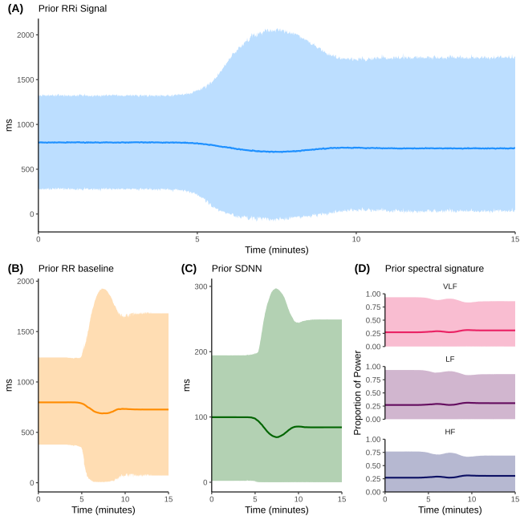
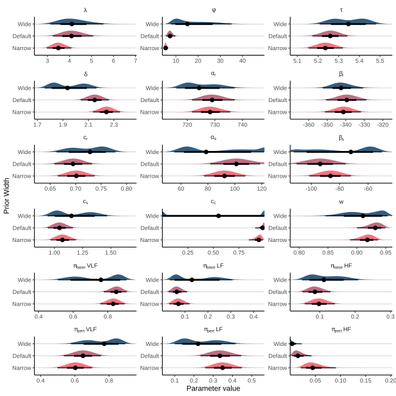
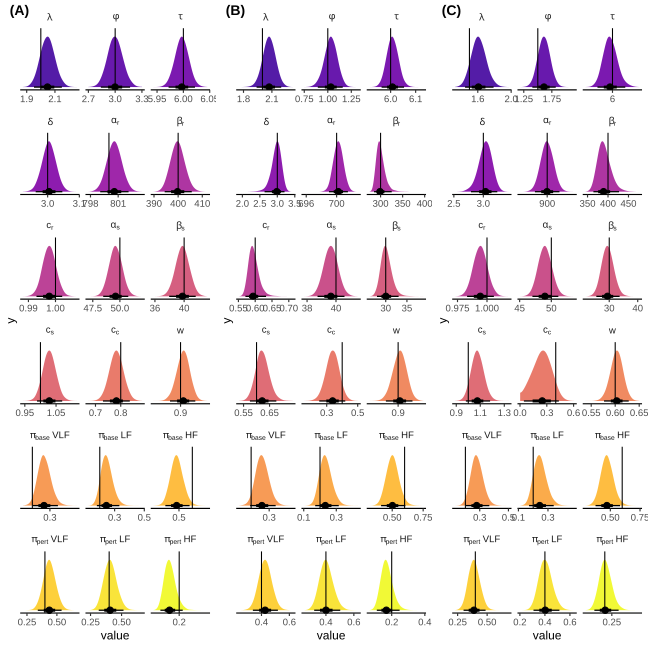
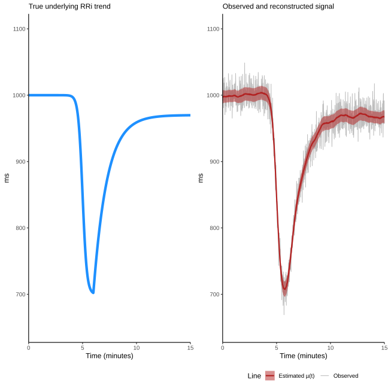
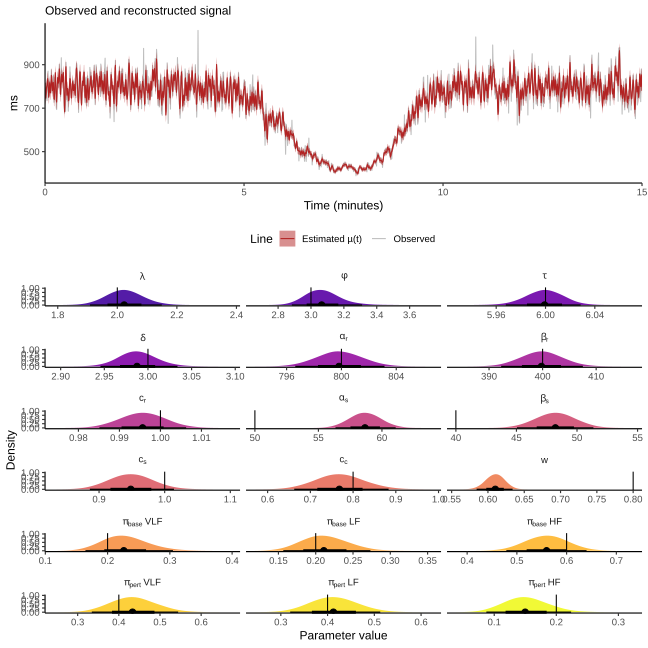
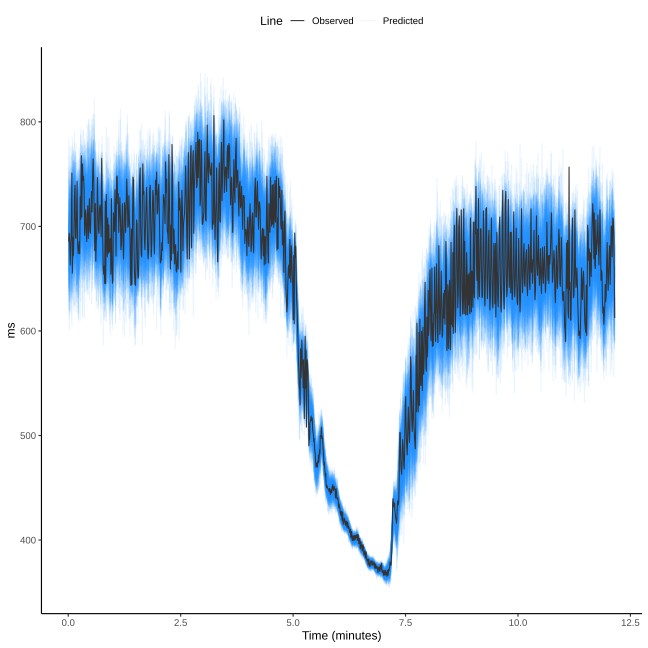
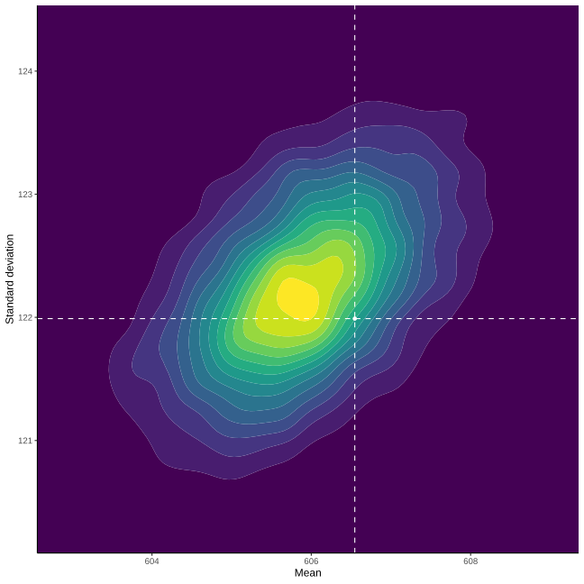

This document provides supplementary information, extended analyses, and technical details to support the findings presented in the main manuscript. The goal of this supplement is to ensure full methodological transparency, computational reproducibility, and to provide a comprehensive validation of the proposed model.

# S1: Model Implementation & Priors

This section details the full implementation of the model, including the complete model code, justification for all prior distributions, and an analysis of the model's sensitivity to these choices.

## S1.1: Fully Commented Stan Model Code

Below is the complete, line-by-line commented code for the generative model implemented in the Stan programming language. The comments explain the function of each parameter, transformation, and sampling statement.

```stan
// Stan Implementation of the Full Generative R-R Interval Model
//
// This model deconstructs an R-R interval time series into several components:
// 1. A time-varying baseline (mean R-R interval).
// 2. A time-varying total standard deviation (SDNN).
// 3. A structured, oscillatory signal representing physiological variability.
// 4. An unstructured residual noise component.
// The model uses a double-logistic form to capture a perturbation-recovery dynamic.

// =====================================================================
// Functions Block
// =====================================================================
// This block defines custom functions that can be used elsewhere in the Stan program.
// Defining functions here is efficient, especially for repeated calculations.
functions {
  /**
   * Calculates a standard logistic growth curve (sigmoid).
   * This function is a fundamental building block for modeling dynamic changes over time.
   * @param t The time vector.
   * @param location The time point of the curve's inflection point (midpoint).
   * @param rate The steepness or rate of the transition.
   * @return A vector of values between 0 and 1 representing the logistic curve.
   */
  vector logistic_curve(vector t, real location, real rate) {
    return inv_logit(rate * (t - location));
  }
}

// =====================================================================
// Data Block
// =====================================================================
// This block declares all the data that will be passed into the model from
// an external source (e.g., R or Python).
data {
  // --- Observed Data ---
  int<lower=1> N;              // Number of data points in the time series.
  vector[N] t;                 // Time vector (e.g., in minutes).
  vector[N] RR;                // Observed R-R intervals (e.g., in ms).

  // --- Fixed Spectral Components (treated as data) ---
  // The model uses a fixed basis of sine and cosine waves.
  // The frequencies are provided, and the model estimates their amplitudes.
  int<lower=1> N_sin;          // Number of sinusoids per frequency band.
  array[3] vector[N_sin] freqs;  // Pre-calculated frequencies for VLF, LF, and HF bands.

  // --- Informative Priors on Double-Logistic (DL) parameters ---
  // Passing these as data allows for setting subject-specific or experiment-specific
  // priors, which can greatly improve model identifiability.
  real<lower=0> tau_mu;        // Expected time of the perturbation event.
  real<lower=0> delta_mu;      // Expected delay between perturbation and recovery.
  real<lower=0> lambda_mu;     // Expected rate of the perturbation.
  real<lower=0> phi_mu;        // Expected rate of the recovery.
}

// =====================================================================
// Transformed Data Block
// =====================================================================
// This block pre-computes quantities that depend only on the data.
// Performing these calculations here is highly efficient, as they are done
// only once before sampling begins, rather than on every iteration.
transformed data {
  // === Data-derived scaling parameters ===
  // These are used to scale parameters to a more natural range (e.g., a standard
  // normal scale), which makes defining priors and sampling more robust.
  real rr_min = min(RR);
  real rr_range = max(RR) - rr_min;
  real rr_sd = sd(RR);
  real t_min = min(t);
  real t_range = max(t) - t_min;

  // --- Precompute sine and cosine basis function templates ---
  // These matrices hold the values of sin(2*pi*f*t) and cos(2*pi*f*t) for all
  // time points and all basis frequencies. This is a major performance optimization.
  array[3] matrix[N, N_sin] sin_mat;
  array[3] matrix[N, N_sin] cos_mat;
  for (j in 1:3) {
    // Convert time from minutes to seconds for frequency calculation (Hz).
    matrix[N, N_sin] T_mat = (t * 60) * freqs[j]';
    sin_mat[j] = sin(2 * pi() * T_mat);
    cos_mat[j] = cos(2 * pi() * T_mat);
  }

  // --- Precompute log-frequencies ---
  // The GP prior operates on the log of the frequencies to better handle
  // the wide range of frequencies often seen in HRV.
  array[3] vector[N_sin] log_freqs;
  array[3] vector[N_sin] log_freqs_scaled;
  array[3] real log_range;
  for (j in 1:3) {
    log_freqs[j] = log(freqs[j]);
    log_range[j] = max(log_freqs[j]) - min(log_freqs[j]);
    // Work on scaled frequency range to make rho parameter scale-agnostic
    log_freqs_scaled[j] = (log_freqs[j] - min(log_freqs[j])) / log_range[j];
  }


  // --- Precompute per-band Gram matrices ---
  // These matrices contain the inner products of the basis vectors (e.g., sin_i * sin_j).
  // They are used later to calculate the *exact* sample variance of the synthesized
  // oscillatory signals, without making the simplifying (and often incorrect)
  // assumption that the basis functions are perfectly orthogonal over the discrete
  // time interval.
  array[3] matrix[N_sin, N_sin] G_sin;
  array[3] matrix[N_sin, N_sin] G_cos;
  array[3] matrix[N_sin, N_sin] G_sin_cos; // For cross-terms between sin and cos.

  // Normalization factor for sample variance (1 / (N-1)).
  real normalization = 1.0 / (N - 1);

  for (j in 1:3) {
    G_sin[j]     = (transpose(sin_mat[j]) * sin_mat[j]) * normalization;
    G_cos[j]     = (transpose(cos_mat[j]) * cos_mat[j]) * normalization;
    G_sin_cos[j] = (transpose(sin_mat[j]) * cos_mat[j]) * normalization;
  }
}

// =====================================================================
// Parameters Block
// =====================================================================
// This block declares all the parameters the model will estimate.
// For optimal performance with Stan's HMC sampler, all parameters are declared on
// an unconstrained scale (the real line, -inf to +inf). They are transformed to their
// meaningful, constrained scales in the `transformed parameters` block.
parameters {
  // --- Shared timing/rate parameters for the double-logistic curves ---
  real tau_logit;        // Location of the perturbation event (logit scale).
  real delta_logit;      // Delay between perturbation and recovery (logit scale).
  real lambda_log;       // Rate of the perturbation (log scale).
  real phi_log;          // Rate of the recovery (log scale).

  // --- Baseline RR(t) trend parameters ---
  real alpha_r_logit;    // Initial baseline RR value (logit-scaled).
  real beta_r_logit;     // Magnitude of the RR drop (logit-scaled).
  real c_r_logit;        // Fractional recovery of the RR drop (logit-scaled).

  // --- Total Variability SDNN(t) trend parameters ---
  real alpha_s_logit;    // Initial baseline SDNN value (logit-scaled).
  real beta_s_logit;     // Magnitude of the SDNN drop (logit-scaled).
  real c_s_logit;        // Fractional recovery of the SDNN drop (logit-scaled).

  // --- Parameters for time-varying frequency proportions p(t) ---
  // These control the transition between a baseline and a perturbed spectral state.
  vector[2] y_base_log;  // Unconstrained (ALR) coords for baseline proportions.
  vector[2] y_pert_log;  // Unconstrained (ALR) coords for perturbed proportions.
  real c_c_logit;        // Fractional recovery of spectral proportions (logit-scaled).

  // --- GP Hyperparameters ---
  // These control the properties of the smooth function for the spectral shape.
  array[3] real rho_gp_logit;   // Length-scale: Controls the smoothness of the spectrum.

  // --- Non-Centered GP Parameter ---
  // Instead of sampling the GP function values directly, we sample standard normal
  // deviates and reconstruct the GP. This is the Non-Centered Parameterization (NCP).
  array[3] vector[N_sin] z_gp;     // Standard normal deviates for the GP.

  // --- Non-Centered Oscillator Coefficients ---
  // The final amplitudes for each sine/cosine pair are also non-centered.
  // We estimate standard normal deviates (`z`), which are then scaled.
  array[3] vector[N_sin] z_sin;    // Standard normal deviates for sine coefficients.
  array[3] vector[N_sin] z_cos;    // Standard normal deviates for cosine coefficients.

  // --- Fractional split of SDNN variance ---
  real w_logit;          // Proportion of total variance that is "structured" (logit scale).
}

// =====================================================================
// Transformed Parameters Block
// =====================================================================
// This block constructs the full generative model step-by-step from the parameters.
// All calculations here are performed at every leapfrog step of the sampler.
transformed parameters {
  // Declare variables that will be used in the likelihood calculation.
  vector[N] mu;          // The final predicted mean RRi trajectory.
  vector[N] var_resid;   // The final residual variance trajectory.

  // --- 0. Map unconstrained parameters to their meaningful scales ---
  // This section applies inverse transformations (e.g., inv_logit, exp) to the
  // parameters, mapping them from the unconstrained real line back to their
  // natural, interpretable scales (e.g., time, ms, proportions).
  real tau    = inv_logit(tau_logit) * t_range + t_min;
  real delta  = inv_logit(delta_logit) * (t_range - tau); // Delta is a fraction of remaining time.
  real lambda = exp(lambda_log);
  real phi    = exp(phi_log);

  real alpha_r = inv_logit(alpha_r_logit) * 2 * rr_range + rr_min;
  real beta_r  = inv_logit(beta_r_logit) * alpha_r; // Beta is a fraction of Alpha.
  real c_r     = inv_logit(c_r_logit) * 2; // Recovery can be up to 200% (overshoot).

  real alpha_s = inv_logit(alpha_s_logit) * rr_sd;
  real beta_s  = inv_logit(beta_s_logit) * alpha_s; // Beta is a fraction of Alpha.
  real c_s     = inv_logit(c_s_logit) * 2; // Recovery can be up to 200% (overshoot).

  real c_c = inv_logit(c_c_logit); // Spectral recovery is between 0-100%.
  real w   = inv_logit(w_logit);   // Structured variance fraction is between 0-1.

  array[3] real rho_gp; // Constrained smoothness of GP
  for (j in 1:3) {
    rho_gp[j] = inv_logit(rho_gp_logit[j]);
  }

  // --- 1. Construct the two logistic building blocks ---
  // These shared curves drive all the dynamic changes in the model.
  vector[N] D1 = logistic_curve(t, tau, lambda);      // Primary perturbation curve.
  vector[N] D2 = logistic_curve(t, tau + delta, phi); // Recovery curve.

  // --- 2. Construct the baseline and SDNN trajectories ---
  // These define the time-varying mean and total standard deviation of the RR signal.
  vector[N] RR_baseline = alpha_r - beta_r .* D1 + (c_r * beta_r) .* D2;
  vector[N] SDNN_t      = alpha_s - beta_s .* D1 + (c_s * beta_s) .* D2;

  // --- 3. Construct the master controller C(t) and spectral proportions p_t ---
  // C(t) governs the transition from a baseline spectral state to a perturbed one.
  vector[N] C_t = D1 .* (1.0 - c_c .* D2);

  // Convert the unconstrained `y_*_log` parameters to 3-element proportion vectors
  // using the softmax function (an inverse Additive Log-Ratio transform).
  vector[3] pi_base = softmax(append_row(y_base_log, 0.0)); // Baseline state.
  vector[3] pi_pert = softmax(append_row(y_pert_log, 0.0)); // Perturbed state.

  // `p_t` smoothly interpolates between the two spectral states based on C(t).
  matrix[N, 3] p_t  = (1.0 - C_t) * pi_base' + C_t * pi_pert';

  // --- 4. Construct the spectral coefficient vectors (u_sin, u_cos) ---
  // This section combines the GP reconstruction and the final coefficient scaling
  // in a single, efficient loop.
  array[3] vector[N_sin] u_sin;
  array[3] vector[N_sin] u_cos;
  array[3] vector[N_sin] log_v; // This will hold the centered GP values.

  for (j in 1:3) {
    // --- Step A: Reconstruct the Centered GP (Non-Centered Parameterization) ---
    // 1. Construct the covariance matrix K from the hyperparameters.
    matrix[N_sin, N_sin] K =
      gp_exp_quad_cov(to_array_1d(log_freqs_scaled[j]), 1, rho_gp[j])
      + diag_matrix(rep_vector(1e-8, N_sin));

    // 2. Compute the Cholesky factor of K.
    matrix[N_sin, N_sin] L = cholesky_decompose(K);

    // 3. Construct the centered log_v by transforming the standard normal `z_gp`.
    log_v[j] = L * z_gp[j];

    // 4. Build positive amplitudes from GP
    vector[N_sin] a_k = exp(log_v[j]);

    // expected diagonal contribution to variance under z ~ N(0,1)
    vector[N_sin] diag_sum = diagonal(G_sin[j]) + diagonal(G_cos[j]); // length N_sin

    // expected base variance under N(0,1) coefficients (cross-terms vanish)
    real base_v_diag = dot_product(a_k .* a_k, diag_sum);

    // normalize so expected variance ≈ 1 (avoid divide by zero)
    vector[N_sin] full_scale = a_k / sqrt(base_v_diag + 1e-12);

    // final NCP coefficients
    u_sin[j] = z_sin[j] .* full_scale;
    u_cos[j] = z_cos[j] .* full_scale;
  }

  // --- 5. Synthesize the raw oscillator signals and mean-center them ---
  matrix[N, 3] S_t_matrix;
  for (j in 1:3) {
    vector[N] S_j = sin_mat[j] * u_sin[j] + cos_mat[j] * u_cos[j];
    // Mean-center to ensure the oscillators represent pure variability, not a baseline shift.
    S_t_matrix[:, j] = S_j - mean(S_j);
  }

  // --- 6. Calculate the exact variance of each oscillator using Gram matrices ---
  // This quadratic form calculates Var(S_j) = u' * G * u efficiently and exactly.
  matrix[3, 3] Sigma_S = rep_matrix(0.0, 3, 3);
  for (j in 1:3) {
    real vj = dot_product(u_sin[j], G_sin[j] * u_sin[j])
              + dot_product(u_cos[j], G_cos[j] * u_cos[j])
              + 2 * dot_product(u_sin[j], G_sin_cos[j] * u_cos[j]);
    Sigma_S[j, j] = vj;
  }

  // --- 7. Deterministic Inversion to find the amplitude A(t) ---
  // This is a powerful trick. Instead of trying to sample A(t), we solve for the
  // exact amplitude needed to make the variance of the structured signal match the
  // target structural variance defined by `SDNN_t` and `w`. This improves efficiency.
  vector[N] var_struct = square(SDNN_t) .* w; // Target structured variance.

  // The denominator is the variance of the weighted sum of oscillators if A_t were 1.
  matrix[N, 3] M = p_t * Sigma_S;
  vector[N] denom_sq = rows_dot_product(M, p_t);
  vector[N] denom = sqrt(denom_sq + 1e-12);

  // The final amplitude is the ratio of the target SD to the current SD.
  vector[N] A_t = sqrt(var_struct) ./ denom;

  // --- 8. Combine components to get the final predicted mean `mu` ---
  vector[N] sum_weighted_S = rows_dot_product(S_t_matrix, p_t);
  mu = RR_baseline + A_t .* sum_weighted_S;

  // --- 9. Define the residual variance used in the likelihood ---
  // The variance not explained by the structured oscillators becomes the residual variance.
  var_resid = square(SDNN_t) .* (1.0 - w);
}

// =====================================================================
// Model Block
// =====================================================================
// This block specifies the priors for the parameters and the likelihood function
// that connects the model to the observed data.
model {
  // === Priors ===
  // Priors are placed on the unconstrained parameters. This is essential for
  // ensuring the priors cover the entire space the sampler is exploring.

  // --- Priors for logistic components (timing and rates) ---
  tau_logit ~ normal(logit((tau_mu - t_min) / t_range), 0.2);
  delta_logit ~ normal(logit(delta_mu / (t_range - tau_mu)), 0.2);
  lambda_log ~ normal(log(lambda_mu), 0.2);
  phi_log ~ normal(log(phi_mu), 0.2);

  // --- Priors for RR(t) and SDNN(t) parameters ---
  alpha_r_logit ~ normal(0, 2);
  beta_r_logit  ~ normal(0, 2);
  c_r_logit     ~ normal(0, 2);
  alpha_s_logit ~ normal(0, 2);
  beta_s_logit  ~ normal(0, 2);
  c_s_logit     ~ normal(0, 2);

  // --- Priors for spectral proportion p_j(t) parameters ---
  y_base_log ~ normal([0, 0]', 2);
  y_pert_log ~ normal([0, 0]', 2);
  c_c_logit ~ normal(1, 2);

  // --- Priors for the Smoothness of the GP ---
  rho_gp_logit   ~ normal(0, 1); // Allows some wiggliness

  // --- Priors for Non-Centered Parameters ---
  // As part of the NCP pattern, the "raw" parameters are given standard normal
  // priors.
  for (j in 1:3) {
    z_gp[j] ~ std_normal();  // Prior for the non-centered GP.
    z_sin[j] ~ std_normal(); // Prior for the sine coefficients.
    z_cos[j] ~ std_normal(); // Prior for the cosine coefficients.
  }

  // --- Prior for the fractional variance split ---
  w_logit ~ normal(3, 2); // Weakly favors a higher proportion of structured variance.

  // === Likelihood ===
  // This is the core statement that connects the model's predictions (`mu` and
  // `var_resid`) to the actual observed data `RR`. The model learns by trying
  // to find parameter values that make the observed data most plausible under a
  // Normal distribution with a time-varying mean and variance.
  RR ~ normal(mu, sqrt(var_resid));
}
```

## S1.2: Prior Justification and Sensitivity Analysis

### S1.2.1: Prior Predictive Checks

To ensure our chosen priors were reasonable and did not unduly influence the posterior, we conducted prior predictive checks. We generated 20,000 datasets directly from the prior distributions (i.e., without conditioning on the data). Supplementary Figure S1 shows that the chosen priors generate a wide range of physiologically plausible (and implausible) response curves, confirming that the model is flexible and that the subsequent posterior is primarily driven by the data, not the priors.

{width=100%}

**Supplementary Figure S1: Prior Predictive Checks.** (A) Simulated RRi signal incorporating deterministic and stochastic components (blue). (B-C) Time-domain reconstruction from prior distributions. (D) Spectral components separated by frequency band. Each line represents the median and the shaded areas represent the 95% highest density interval from 20,000 dataset generated from the prior distribution. The wide distribution of curves demonstrates that the priors are not restrictive.

### S1.2.2: Prior Sensitivity Analysis

To assess the robustness of our conclusions, we performed a sensitivity analysis by re-fitting the model on the empirical data using three different sets of priors: (1) the main manuscript's weakly informative priors, (2) "flatter" priors with two times larger variance, and (3) "tighter", more informative priors with half of original variance. Supplementary Figure S2 shows the posterior distribution for key parameters under each condition. The central conclusion of dissonant recovery (a credible difference between $c\_r$ and $c\_s$) remains unchanged across all specifications, with consistent overlapping credible intervals for all model parameters demonstrating the robustness of our primary finding.

{width=100%}

**Supplementary Figure S2: Prior Sensitivity Analysis.** Posterior distributions and 95% credible intervals for all model parameters under three different prior specifications. The overlapping credible intervals provide compelling evidence of robustness in parameter estimation.

## S1.3: Computational Environment

All analyses were performed using `R` (version 4.5.0) and the `rstan` interface (version 2.32.7) to `Stan` (version 2.32.2). The MCMC sampler was run with 4 chains for 10,000 iterations each, with the first 5,000 discarded as warmup, resulting in 20,000 posterior samples.

# S2: Extended Simulation Studies

This section provides a complete report of the simulation studies, including full parameter recovery results and an examination of the model's behavior under conditions of misspecification.

## S2.1: Full Parameter Recovery Results

Supplementary Figure S3 displays the complete posterior distributions for all generative parameters from the three simulation scenarios described in the main text, plotted against their known ground-truth values (red vertical lines). The posteriors are well-centered on the true values, and the true values are consistently contained within the 95% credible intervals, demonstrating parameter recovery.

{width=100%}

**Supplementary Figure S3: Full Posterior Recovery of Ground-Truth Parameters.** Posterior density plots for all model parameters across the three simulation scenarios (A, B, C). Vertical black lines indicate the true parameter values used to generate each simulated scenario.

## S2.2: Model Misspecification Analysis

### S2.2.1: Asymmetric Recovery Dynamics

We generated a synthetic dataset where the recovery phase followed an exponential decay (a highly asymmetric form) rather than a logistic curve. Supplementary Figure S4 shows the model's attempt to fit this signal. Contrary to first expected, the model captures the general trend and its functional form fully captures the sharp "knee" and long tail of the exponential decay, managing to adapt to this type of model misspecification during the recovery phase, even in the face of a different data generating processes. This provides additional evidence of the current model architecture's flexibility.

{width=100%}

**Supplementary Figure S4: Model Fit to Asymmetric Recovery Data.** The left panel shows the true underlying heart trajectory (blue line). Right panel shows the model's posterior trajectory (red line) and 95% highest density interval (shaded area in red) is overlaid on synthetic data with an exponential recovery with gaussian noise (grey line). 

The R code and model parameters used to generate the data can be seen in the following code block:

```R
# --- 1. Define Helper Functions ---

# Standard logistic (sigmoid) function
logistic_curve <- function(t, location, rate) {
  1 / (1 + exp(-rate * (t - location)))
}

# Asymmetric exponential recovery curve (shaped like a CDF)
exponential_recovery <- function(t, start_time, rate) {
  # Time since the recovery event started
  time_since_start <- pmax(0, t - start_time)
  # Cumulative exponential function, scaled from 0 to 1
  1 - exp(-rate * time_since_start)
}


# --- 2. Set Simulation Parameters ---

# Time parameters
N      <- 1200   # Number of data points (e.g., 20 minutes at 1 Hz)
t      <- seq(from = 0, to = 15, length.out = N) # Time vector in minutes
tau    <- 5      # Time of perturbation event (minutes)
delta  <- 1      # Delay between perturbation and recovery onset (minutes)
lambda <- 5      # Rate/steepness of the logistic perturbation
phi    <- 0.8    # Rate of the exponential recovery (lower = slower recovery)

# RRi amplitude parameters
alpha  <- 1000   # Initial baseline RRi (ms)
beta   <- 300    # Magnitude of the RRi drop (ms)
c_r    <- 0.90   # Fractional recovery (0.9 = 90% recovery of the drop)

# Noise parameter
sigma  <- 15     # Standard deviation of the residual noise (ms)


# --- 3. Generate the Time Series ---

# Create the perturbation and recovery building blocks
perturbation <- logistic_curve(t, location = tau, rate = lambda)
recovery     <- exponential_recovery(t, start_time = tau + delta, rate = phi)

# Combine the components to create the true mean RRi trajectory
# The logic follows the manuscript's model: Baseline - Drop + Recovery
mean_rri <- alpha - (beta * perturbation) + (c_r * beta * recovery)

# Add Gaussian noise to create the final observed signal
set.seed(42) # for reproducibility
observed_rri <- rnorm(n = N, mean = mean_rri, sd = sigma)

# --- 4. Package and Save Data ---

# Store the results in a data frame
sim_data <- data.frame(
  time = t,
  true_mean_rri = mean_rri,
  observed_rri = observed_rri
)
```

### S2.2.2: Non-Gaussian Noise Structure

We generated synthetic data using a Student's-t distributed noise term (with 3 degrees of freedom) instead of a Gaussian one. Supplementary Figure S4 shows that while the model still recovers the primary trajectories, the estimate for the structured variance fraction ($w$) is biased upwards to compensate the wider tails of the distribution. However, despite sampling from a non-gaussian distribution, the model is able to recover all the other parameters within credible intervals, providing evidence of the robustness of the model to distribution misspecification. Additionally, even though the difference form a $w = 0.80$ and $w = 0.82-0.83$ is statistically significant credible-interval-wise, it could be deemed neglible from a practical stand point.

{width=100%}

**Supplementary Figure S4: Impact of Non-Gaussian Noise.** In the upper panel, the estimated signal recovered from posterior predictions (in red) overlaid the generated synthetic signal from a heavy-tailed Student's-t noise (in grey). Lower panel shows the posterior distribution for all model parameters when the model is fit to data with heavy-tailed Student's-t noise with 3 degrees of freedom. The ground truth parameters are well recovered except for structured variance fraction $w$.

The R code used to generate the data is presented next

```r
# 1. --- Simulation Setup ---
# Define shared simulation parameters
SIM_DURATION_MIN <- 15 # Total duration in minutes
SAMPLING_RATE_HZ <- 2  # Sampling rate for RRi series
N_points <- SIM_DURATION_MIN * 60 * SAMPLING_RATE_HZ
time_vector <- seq(0, SIM_DURATION_MIN, length.out = N_points)

# Define frequency bands (VLF, LF, HF)
N_SINUSOIDS <- 20 # Number of sinusoids to approximate spectrum in each band
freq_bands <- list(
  vlf = seq(0.003, 0.039, length.out = N_SINUSOIDS),
  lf  = seq(0.040, 0.149, length.out = N_SINUSOIDS),
  hf  = seq(0.150, 0.400, length.out = N_SINUSOIDS)
)

# --- Define Parameters for the Three Scenarios ---
# Scenario 1: Classic Sympatho-Vagal Response
# A sharp drop in RR/SDNN with a partial recovery, accompanied by a shift
# from high-frequency (HF) to low-frequency (LF) power and back.
params <- list(
  # Double-logistic timing
  lambda = 3, phi = 2, tau = 6, delta = 3,
  # RR(t) params
  alpha_r = 800, beta_r = 400, c_r = 1.0,
  # SDNN(t) params
  alpha_s = 50, beta_s = 40, c_s = 1.0,
  # Spectral & Noise params
  c_c = 0.8, w = 0.80, # 80% structured variance
  # p(t) params
  pi_base = c(0.2, 0.2, 0.6), # VLF, LF, HF - Rest (HF dominant)
  pi_pert = c(0.4, 0.4, 0.2), # VLF, LF, HF - Stress (LF dominant)
  rho_gp = c(1, 1, 1)
)

# -------------------------------------------------------------------------


# 2. --- Generate and Visualize Data ---
# This block demonstrates how to use the function and visualize the output.

# --- Generate data for Scenario i ---
sim_data <-
  generate_rri_simulation(
    N = N_points,
    t_max = SIM_DURATION_MIN,
    params = params,
    N_sin = N_SINUSOIDS,
    t_dist = TRUE,
    seed = 1,
    nu = 3
  )
```

And the components from the R function `generate_rri_simulation`, used to simulate the data, included the Student-t distribution, is the following:

```r
#' Generate a synthetic R-R interval time series from constrained parameters
#'
#' This function encapsulates the full data generating process from the Stan model.
#' All model parameters are provided on their constrained, physiologically meaningful
#' scale.
#'
#' @param N Number of data points.
#' @param t_max Maximum time in minutes.
#' @param N_sin Number of sinusoids per frequency band.
#' @param params Named list with model parameters.
#' @param seed An integer for reproducibility.
#' @param ... Currently not used.
#' @param t_dist Logical. Use a t-distribution instead of a normal to generate the data. Default is FALSE.
#' @param nu Numeric. Nu parameter of the Student-t distribution controlling the tails of the distribution. Only used when `t_dist` is TRUE.
#'
#' @return A data frame containing the time vector 't', the final generated
#'   'RR' series, the underlying mean 'mu', and other key components.
generate_rri_simulation <- function(N,
                                    t_max,
                                    params,
                                    N_sin,
                                    seed = 123,
                                    nu = NULL,
                                    t_dist = FALSE) {

  # Helper function to compute the GP's squared exponential covariance kernel
  gp_exp_quad_cov <- function(x, rho) {
    N <- length(x)
    K <- matrix(0, N, N)
    for (i in 1:N) {
      for (j in 1:N) {
        K[i, j] <- exp(-0.5 * ((x[i] - x[j]) / rho)^2)
      }
    }
    return(K)
  }

  # Set seed for complete reproducibility
  set.seed(seed)

  # --- 1. Define Core Dynamic Functions ---
  # These are the double-logistic building blocks for the model's dynamics.
  D_1 <- function(t) { 1 / (1 + exp(-params$lambda * (t - params$tau))) }
  D_2 <- function(t) { 1 / (1 + exp(-params$phi * (t - params$tau - params$delta))) }

  # Define the simulation time grid
  t <- seq(0, t_max, length.out = N)

  # --- 2. Generate Time-Varying Trajectories ---
  # These define the evolution of the signal's mean, total variability, and spectral mix.
  RR_t <- params$alpha_r - params$beta_r * D_1(t) + params$c_r * params$beta_r * D_2(t)
  SDNN_t <- params$alpha_s - params$beta_s * D_1(t) + params$c_s * params$beta_s * D_2(t)
  C_t <- D_1(t) * (1 - params$c_c * D_2(t))

  # Time-varying band proportions p_j(t) via convex combination
  p_j <- (1 - C_t) %*% t(params$pi_base) + C_t %*% t(params$pi_pert)
  colnames(p_j) <- c("VLF", "LF", "HF")

  # --- 3. Pre-computation of Basis Functions (like Stan's transformed data) ---
  band_defs <- list(
    VLF = c(0.003, 0.039),
    LF  = c(0.040, 0.149),
    HF  = c(0.150, 0.400)
  )

  freqs_list <- lapply(band_defs, function(b) seq(b[1], b[2], length.out = N_sin))
  log_freqs_list <- lapply(freqs_list, log)

  # Scale log-frequencies to [0, 1] for a scale-agnostic GP
  log_freqs_scaled_list <- vector("list", 3)
  for (j in 1:3) {
    min_log_f <- min(log_freqs_list[[j]])
    range_log_f <- max(log_freqs_list[[j]]) - min_log_f
    log_freqs_scaled_list[[j]] <- (log_freqs_list[[j]] - min_log_f) / range_log_f
  }

  # Precompute sine/cosine basis matrices and Gram matrices
  sin_mat_list <- vector("list", 3)
  cos_mat_list <- vector("list", 3)
  G_sin_list <- vector("list", 3)
  G_cos_list <- vector("list", 3)
  G_sin_cos_list <- vector("list", 3)

  for (j in 1:3) {
    T_mat <- outer(t * 60, freqs_list[[j]])
    sin_mat_list[[j]] <- sin(2 * pi * T_mat)
    cos_mat_list[[j]] <- cos(2 * pi * T_mat)

    normalization <- 1.0 / (N - 1)
    G_sin_list[[j]] <- t(sin_mat_list[[j]]) %*% sin_mat_list[[j]] * normalization
    G_cos_list[[j]] <- t(cos_mat_list[[j]]) %*% cos_mat_list[[j]] * normalization
    G_sin_cos_list[[j]] <- t(sin_mat_list[[j]]) %*% cos_mat_list[[j]] * normalization
  }

  # --- 4. Generate Spectral Components via GP (like Stan's transformed parameters) ---
  # This is the core of the new generative process.

  # A. Simulate the standard normal deviates (the "z" parameters)
  z_gp <- replicate(3, rnorm(N_sin), simplify = FALSE)
  z_sin <- replicate(3, rnorm(N_sin), simplify = FALSE)
  z_cos <- replicate(3, rnorm(N_sin), simplify = FALSE)

  # B. Loop through bands to generate coefficients
  u_sin_list <- vector("list", 3)
  u_cos_list <- vector("list", 3)
  log_v_list <- vector("list", 3)

  for (j in 1:3) {
    # Step 1: Generate the smooth spectral envelope from the GP
    K <- gp_exp_quad_cov(log_freqs_scaled_list[[j]], params$rho_gp[j])
    K <- K + diag(1e-10, N_sin) # Scaled jitter
    L <- t(chol(K)) # Lower triangular Cholesky factor
    log_v <- L %*% z_gp[[j]]

    log_v_list[[j]] <- log_v

    # Step 2: Normalize the GP output to have unit expected variance
    a_k <- exp(log_v)
    diag_sum <- diag(G_sin_list[[j]]) + diag(G_cos_list[[j]])
    base_v_diag <- sum((a_k^2) * diag_sum)
    full_scale <- a_k / sqrt(base_v_diag + 1e-12)

    # Step 3: Generate the final oscillator coefficients (NCP)
    u_sin_list[[j]] <- z_sin[[j]] * full_scale
    u_cos_list[[j]] <- z_cos[[j]] * full_scale
  }

  # --- 5. Synthesize Signal and Calculate Final Components ---
  S_t_matrix <- matrix(0, nrow = N, ncol = 3)
  Sigma_S_diag <- numeric(3) # Will store Var(S_j) for each band

  for (j in 1:3) {
    # Synthesize the j-th oscillator signal and mean-center it
    u_sin <- u_sin_list[[j]]
    u_cos <- u_cos_list[[j]]
    S_j <- sin_mat_list[[j]] %*% u_sin + cos_mat_list[[j]] %*% u_cos
    S_t_matrix[, j] <- S_j - mean(S_j)

    # Calculate its *exact* variance using the Gram matrices
    vj <- t(u_sin) %*% G_sin_list[[j]] %*% u_sin +
      t(u_cos) %*% G_cos_list[[j]] %*% u_cos +
      2 * t(u_sin) %*% G_sin_cos_list[[j]] %*% u_cos
    Sigma_S_diag[j] <- vj
  }

  # Calculate the time-varying scaling amplitude A(t)
  var_structured <- SDNN_t^2 * params$w
  denom_sq <- rowSums((p_j %*% diag(Sigma_S_diag)) * p_j)
  A_t <- sqrt(var_structured) / sqrt(denom_sq + 1e-12)

  # Combine components for the final mean trajectory
  sum_weighted_S <- rowSums(S_t_matrix * p_j)
  mu <- RR_t + A_t * sum_weighted_S

  # Generate the final noisy RRi signal
  var_noise <- SDNN_t^2 * (1 - params$w)

  if (t_dist) {
    sigma_t <- sqrt(var_noise * (nu - 2) / nu)
    # Draw from standardized Student-t and scale/shift
    RRi_t <- mu + sigma_t * rt(N, df = nu)
  } else {
    RRi_t <- rnorm(N, mean = mu, sd = sqrt(var_noise))
  }

  # --- 6. Format Output ---
  out <- data.table::data.table(
    t = t,
    RR = RRi_t,
    mu = mu,
    RR_baseline = RR_t,
    SDNN_t = SDNN_t,
    A_t = A_t,
    w = params$w,
    p_vlf = p_j[, 1],
    p_lf = p_j[, 2],
    p_hf = p_j[, 3]
  )

  return(list(
    data = out,
    freqs = freqs_list,
    log_v = log_v_list
  ))
}
```

# S3: Full Empirical Analysis Diagnostics

This section provides a complete set of diagnostic checks for the HMC analysis of the empirical N-of-1 dataset to ensure the reliability of the inference.

## S3.1: Posterior Distributions

Supplementary Figure S5 shows the traceplots for all key parameters from the empirical model fit.

{width=100%}

**Supplementary Figure S5: Full Traceplots for Empirical Analysis.** MCMC traceplots for four chains, showing stationary, well-mixed chains.

## S3.2: MCMC Diagnostic Statistics

All MCMC chains converged successfully. There were zero divergent transitions after the warmup period. Supplementary Table S1 provides the R-hat, effective sample size (ESS), Monte Carlo Standard Error (MCSE) and Pareto K values for all key parameters, confirming the reliability of the posterior estimates.

```{r}
readRDS(file = "tables/tbl-S1.RDS")
```

**Supplementary Table S1: MCMC Diagnostic Statistics.** All R-hat values are near 1.00 up to three digits, both tail and bulk ESS are greater than 5,000 and all Pareto K values are lower than 0.5, confirming the reliability of the posterior estimates.

## S3.3: Posterior Predictive Checks (PPC)

To assess the model's descriptive adequacy, we performed posterior predictive checks. Supplementary Figure S6 overlays the empirical RRi time series with 100 time series simulated from the fitted model's posterior predictive distribution. The simulated data closely resembles the observed data in its overall structure and variance. Furthermore, Supplementary Figure S7 shows that the distributions of key summary statistics (mean, SD, and autocorrelation at lag 1) from the simulated data are well-centered on the values from the observed data, indicating an adequate model fit.

{width=100%}

**Supplementary Figure S6: Graphical Posterior Predictive Check.** The observed RRi data (dark line) is shown with 100 replicated datasets (faint blue lines) generated from the fitted model.

{width=100%}

**Supplementary Figure S7: Distributional Posterior Predictive Checks.** The distribution for two summary statistics calculated from the replicated datasets. The vertical and horizontal white line shows the value of the statistic from the actual observed data, meanwhile the 2-dimensional filled density highlight the distribution of summary statistics from the predicted RRi signal.
